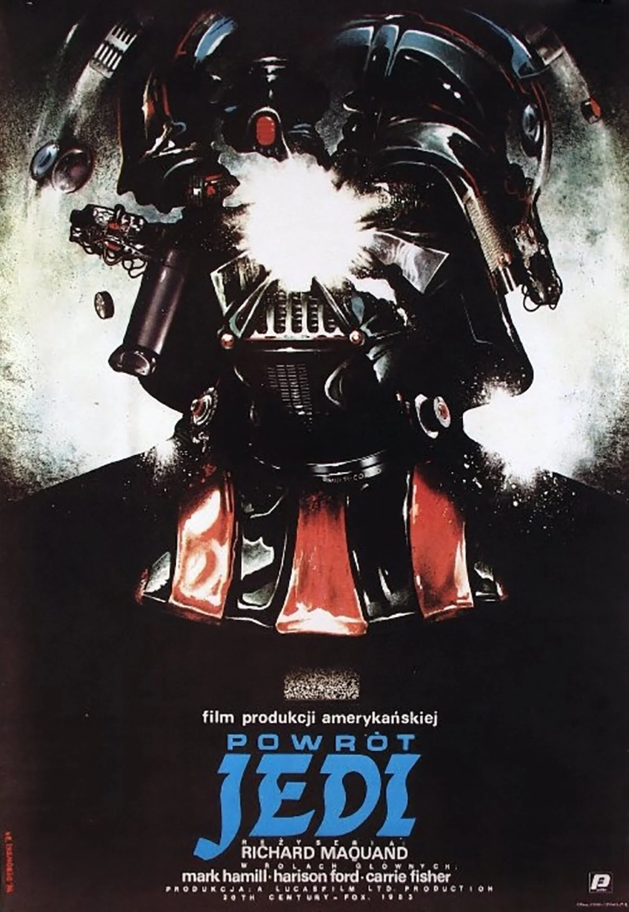

On Letterboxd, if you pay for the top subscription you can choose the poster that shows up when people read your review. I was browsing through Letterboxd one day when I found a very strange poster for a movie. 

I performed a reverse image search and found this very delightful piece of movie history. For some reason, it seemed like the Polish had very different sensibilities when it came to movie poster design. Your traditional Hollywood poster tends to blend into each other. A mishmash of floating heads, oranges and blues, all of them trying their best to look cool for the camera. 

Polish film posters, on the other hand, are weirdly abstract. A heavy focus is placed on representing thematic elements and the symbols behind the film rather than depicting any scene or even the cast of the film. They tend to be disturbing with very horrific imagery or very symbolic and abstract.

Here's the Polish poster for Return Of The Jedi:

I dove deeper into why this happened. Why did an art movement form around film posters, why such grotesque imagery or abstract symbolism? The Polish being under a Stalinist regime were heavily censored and were actively punished for producing fine art. In the midst of all this, what they found was that the state cared not for the film posters themselves. This meant that an art resistance formed around making film posters and using them as an outlet for their creativity.

> At one point the country was even erased from the map for a substantial amount of time and its territory was split between Prussia, Austria and Russia. These threatening circumstances shaped a mentality of resistance which is deeply ingrained into the Polish collective mind. But despite all these existential crises a significant artistic community was thriving with its epicenter in Krakow. - from [Sabukaru's post about Polish movie posters](https://sabukaru.online/articles/the-insane-history-of-polish-movie-posters)

This mentality of resistance bleeds through in the artwork, certain posters feel like a statement, taking advantage of the complete creative freedom they were granted. The posters are so strange and eerie that it's worth questioning whether they were allowed to see the films beforehand. I encourage you to check out the two excellent deep dives below about the wild history of these posters. I had a delightful time checking out different posters for films I knew and loved.

Of course, in the modern age, the entire world gets the same poster. But, the art movement lives on, where patrons contribute very large sums of money to commission posters for their beloved films. I'm glad the movement lives on in this form at the very least.

I encourage you to check  out this [list](https://letterboxd.com/marlolando/list/aesthetic-polish-movie-posters/).

Sources: 
- [THE INSANE HISTORY OF POLISH MOVIE POSTERS - Sabukaru](https://sabukaru.online/articles/the-insane-history-of-polish-movie-posters)
- [The Weird & Wonderful World of Polish Film Posters - Broadly Specific](https://broadly-specific.com/2021/02/16/the-weird-wonderful-world-of-polish-film-posters/)
