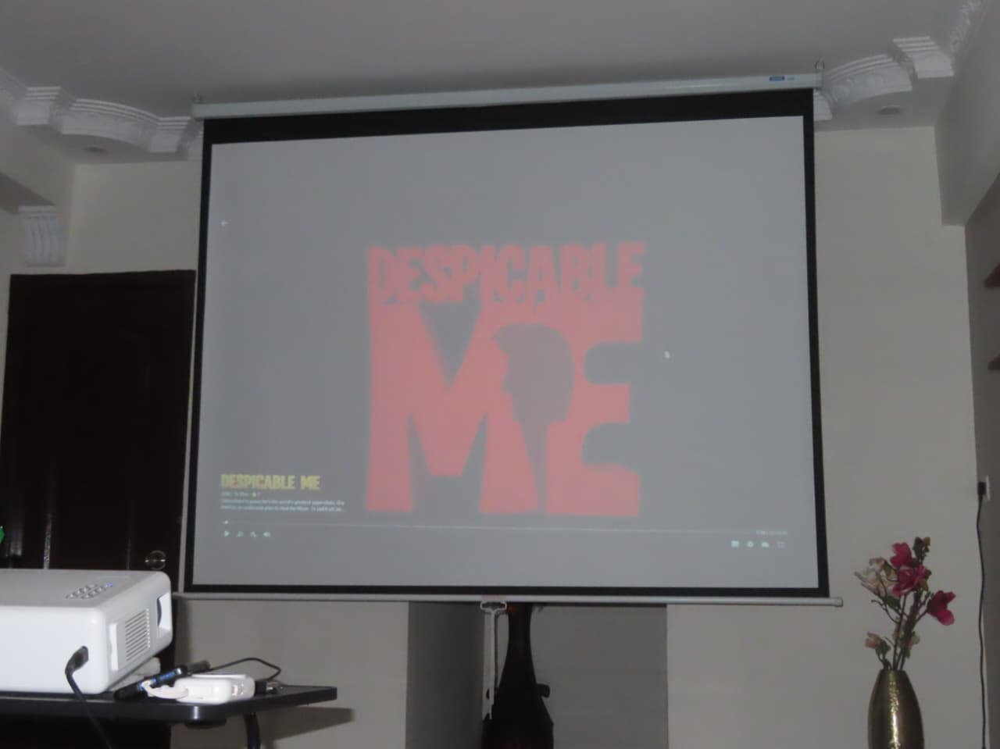
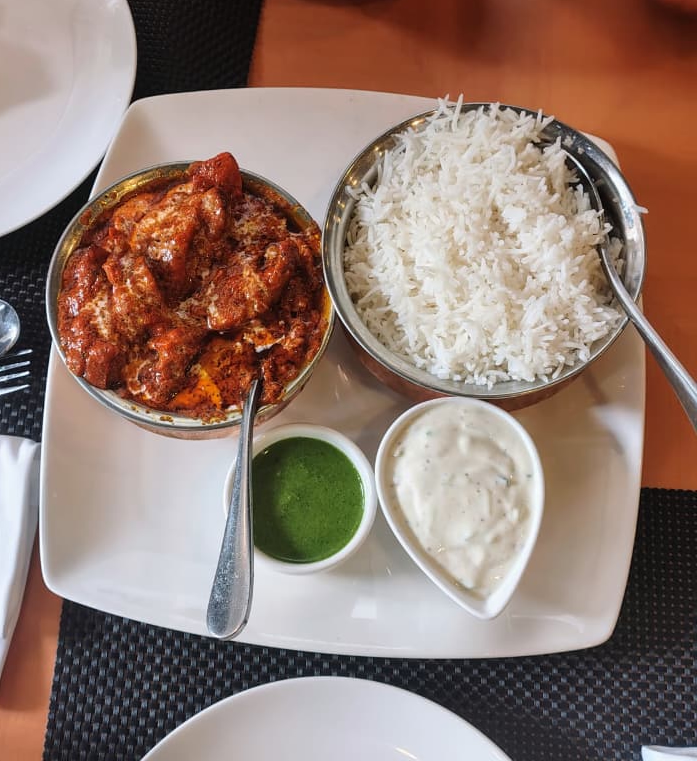
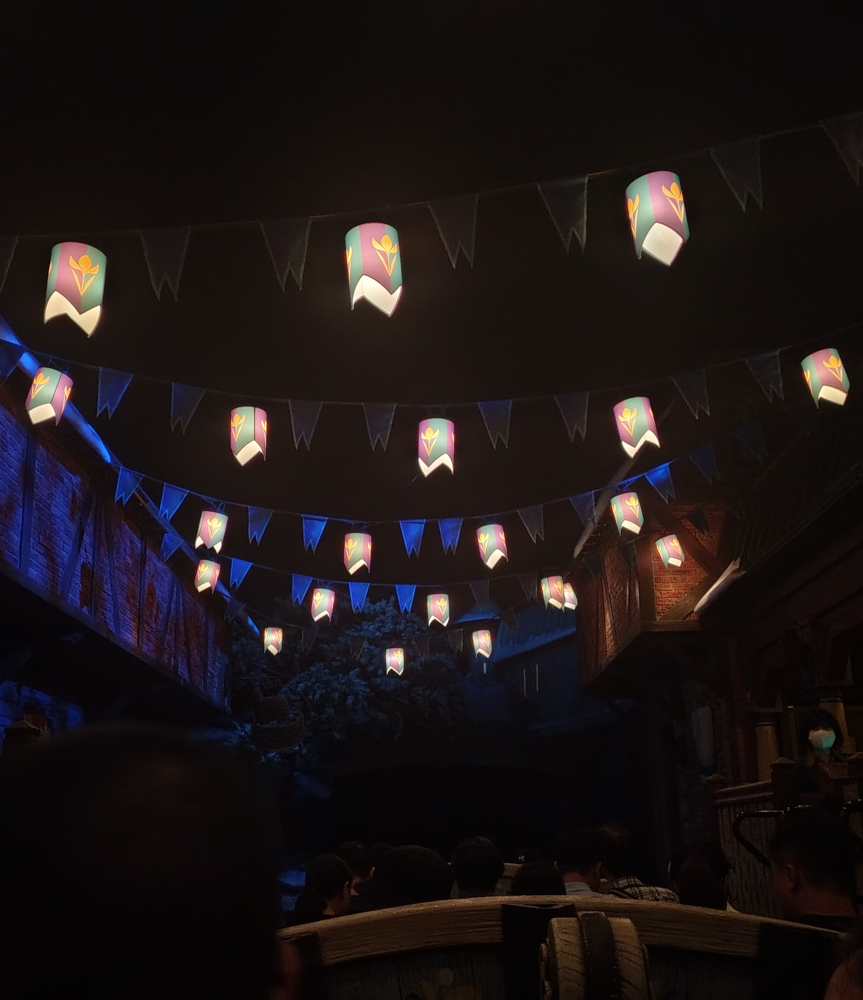
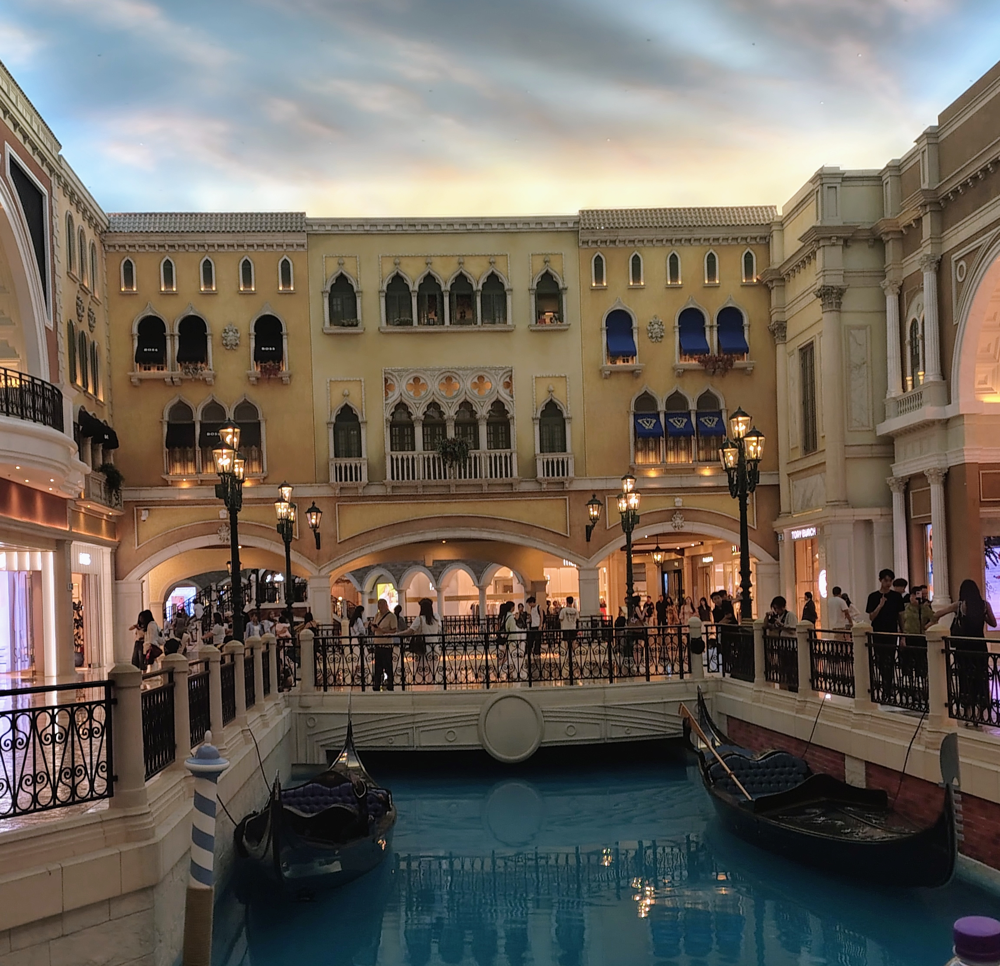
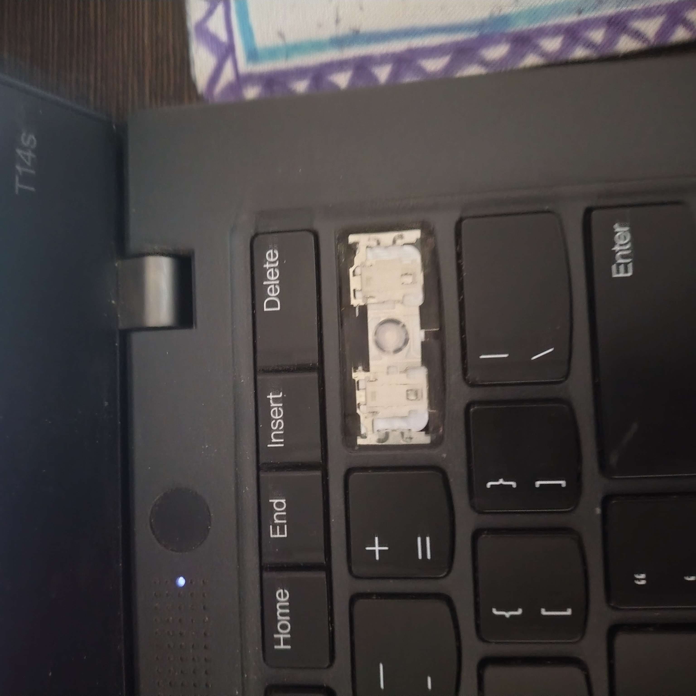
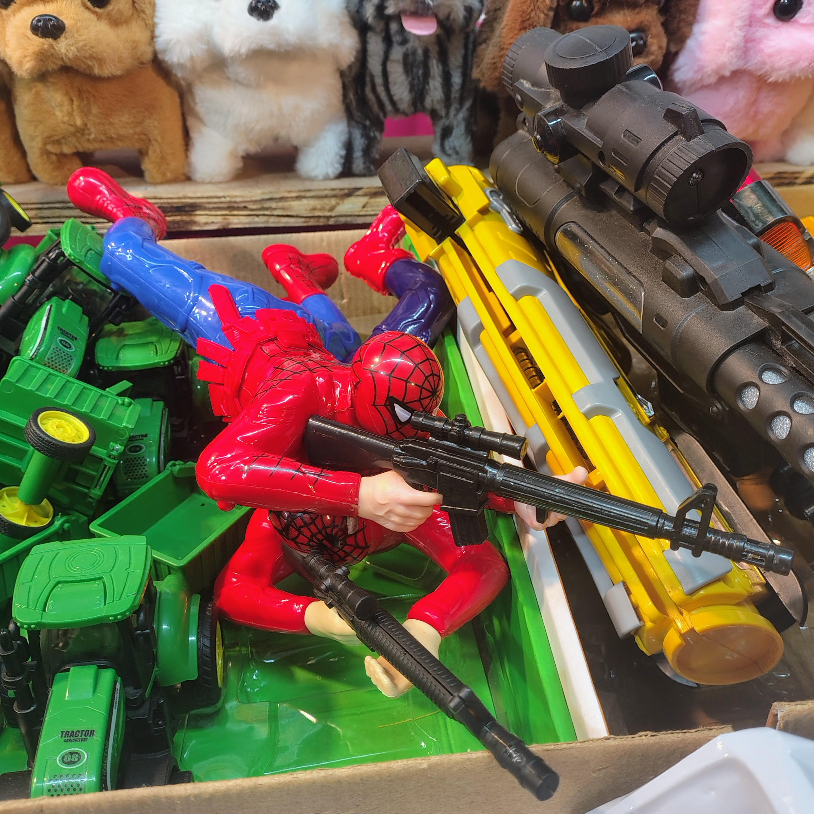

Today's IndieWebClub session was focused on why the IndieWeb in general seems to have an aversion to posting other forms of media. To help fix this, I have decided to include 5 pictures I've taken recently and talk about them.

# Despicable Me

On the last week of July, I got together with a bunch of friends on a very impulsive decision to spend the entire night together doing a complete watch through of the Despicable Me and Minions movies. After doing this, we'd go to a morning showing of Minions And Monsters.

When I usually show movies to friends, there's an added pressure to actually enjoy the film and not interrupting the movie, because the movie is a piece of High Art with a Message and a Theme. The Despicable Me franchise consist of a bunch of animated movies that are fun adventures.

We just had fun going through each film and loosely following the plot and making jokes every few minutes or so. Sometimes we'd stop the movie altogether to just talk about a random story that came up in conversation.

Over time, the movies simply became the context with which our hangout existed in.

The most surprising part about all this is that Minions and monsters is honestly a really solid movie. A weird kind of theme park ride filled with homages for cinephiles.

# Butter Chicken In Hong Kong

I went on a trip to Hong Kong last week, and this is a picture of the best meal I had there. It was also one of the best butter chickens I had, where the balance was done really perfectly. It made me wonder about the kind of brain drain that was going on, because the chef was Indian. The "authenticity" of the food couldn't be questioned, yet here I was on foreign land being served better Indian food than I would have gotten back home.

# Disneyland vs Venetian

I cheated, these are two images. But during my trip to Hong Kong, I also visited Macau, which was a very casino ridden place. One of the bigger casinos I went to was The Venetian. Inside the Venetian, there's this "canal", with a bunch of canoes that you could ride in. A bunch of big brands on either side. I couldn't help but feel this overwhelming sense of disgust about the whole affair. This simulation of a real place, built completely out of a vice.

The very next day, we visited Disneyland, which is filled with these fake buildings and simulations of cities... yet I didn't feel that way.

I think the core of it is the intent somehow. I see The Venetian and I see a lot of greed and consumption. I go to Disneyland and I see a lot of kids laughing and their eyes sparkling with wonder.

# Lost Backspace

My backspace has been growing weaker and weaker so I just took the keycap out and started pressing the switch directly.

Soon this keycap will die out. Perhaps I just have to force myself to not make mistakes.

# Spider-Man Sniper

I found this wonderful thing at an exhibition. I leave this without comment as I find the photo delightful on its own.

# Closing Notes

Moving forward, I'm going to experiment a lot with different forms of media. I need new things to procrastinate with anyway.
