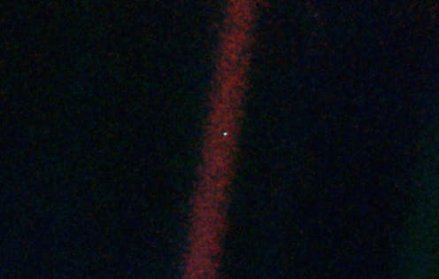

We, as humans, are naturally egoistic. I don't say that as if it's a problem but rather as an observation. The problems we face on a day to day basis casts a veil on our eyes so that we don't even stop to consider that maybe these problems don't matter. Take a look at this photo:

This photo has one dot. It was taken from a probe and that dot is us. That dot is Earth.

And this photo makes me think. Seeing Earth, an gigantic object which I cannot even begin to imagine, as something that's no smaller than a speck of dust gives me a reality check.

How much of what matters to us really matters?

How do we live in a way that is able to cope with this mapngssive scale?

Life is short, comparing a hundred years to the entirety of the Earth is an even bigger reality check but...this photo really scares me, more than any big number can or a graph can.

This photo is simple, but its implications are so vast. Is our life on this Universe meaningless?

To the rest of the Universe are we less than a speck of dust?

We probably don't have a purpose and if we do, in the grand scale of things, it's probably the equivalent of setting down a brick for an infinitely long brick wall maybe even half a brick. We won't even be able to understand what this brick wall is nor even understand it's true scale.

Infinity is such a mind boggling concept for us, we are taught to deal with finite numbers and we can do that (to a degree) but when it comes to infinity, a whole new set of rules come into play that our brains cannot understand.

It is sad to think that art is both meaningful and meaningless at the same time. Art itself is something else altogether. It is a form of communication between the artist and the viewer, like an inside joke. But art is not reliable as communication as it is often misinterpreted but this misinterpretation is part of what makes art so...charming. If anything is out there, it will probably have a hard time understanding why art is important to us as a culture. Heck, I don't even know if they will understand what culture is.

Stephen R. Covey talked about paradigms or ways of thinking, how they are 'maps' for how we see the world. How different will our paradigm be from an alien's. Who will win in an intellectual boxing match? Us or them? Or is intellect a whole other thing for them.

What popular science fiction tends to ignore is that aliens probably don't want to invade us. That's why Arrival, directed by Denis Villenueve, to me is the perfect depiction of aliens in pop culture. The language is so _mysterious_, the aliens look so _menacing_ but peaceful, their mindset are so evolved that the language itself acts as a pathway to breaking the suffocation of time. In fact in the movie none of the conflicts are caused by the aliens.

Sometimes I feel choked. Time backing me into a corner, locking me in this little instant and then shooting me towards my death at a steady but accelerating pace. That statement may sound contradictory but I assure you it's not!

I guess this photo makes me understand that I'm small and insignificant, a grain of sand in the desert of Time and Space. And maybe...that's okay. Maybe having a small life in which we cherish what we love and making no impact is a good way to live life. Maybe the fact that since we can't influence even a little of the Universe lifts a huge weight off our shoulders. The Universe may be indifferent but...it is also kind.

Yes, I got this from that one photo. No, I was not on drugs.
