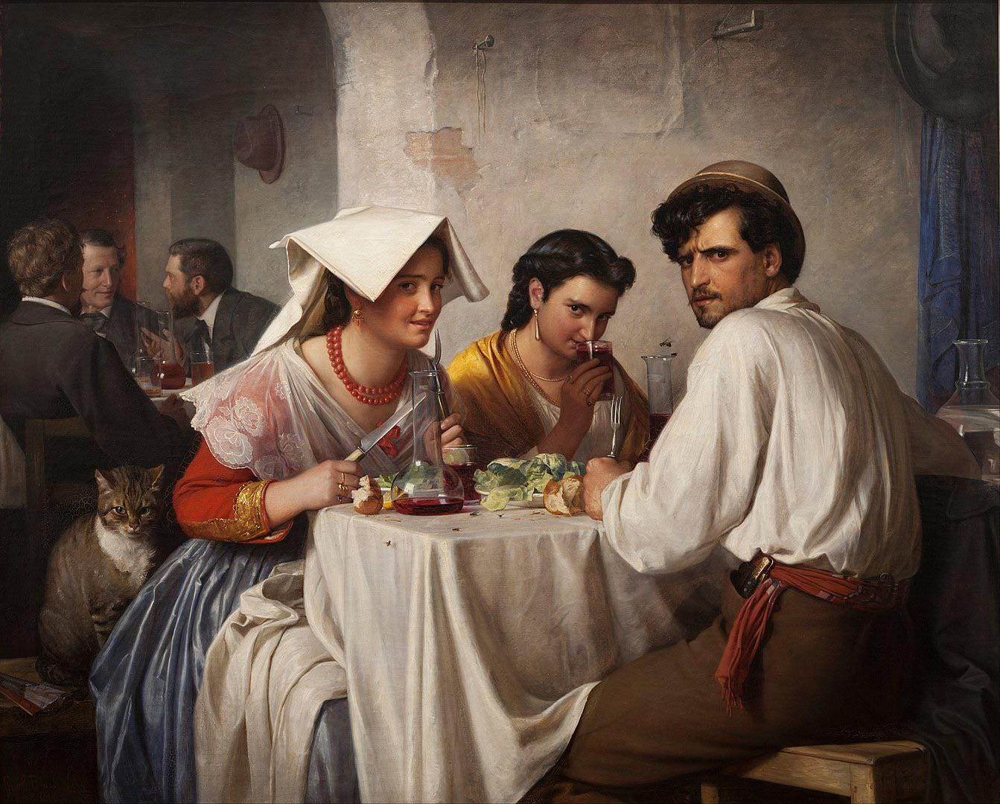

Disclaimer: I use the word art a lot in the latter part of this post, by art I do not mean paintings. I mean any form of creative expression **such as movies, books, poetry, heck even doodles on the wall that a 5-year-old kid made.**

There’s this painting by Carl Bloch, called “In A Roman Osteria.” It’s a fairly simple and mundane painting, but it captured my imagination the first time I saw it.

I can’t remember where I saw this painting, but it captured me. I can’t fully explain why I’m drawn to this painting, but I am. I don’t know enough about ‘art’ to go over what makes this painting powerful, but I know that it is.

What were those three men in the back arguing about? Whose perspective are we seeing from, and what did they do to anger that cat and that man so much. We should probably tell him that a bug is about to enter his drink. Why does the woman on the right have a napkin over her head, and why did this man not hang his hat, there was a holder in front of him?

Every time I look at this painting, I get this odd feeling in my chest. Like I’m witnessing a place and time that no longer exists, and yet seeing it in front of me in painstaking detail. This feeling that history, as vast and grand and epic as it was, was still populated by people. People like you and me, people who lived in a world that was just as real as the world around us right now is. They felt themselves part of this large complex moving machine that they cannot understand and learned to be happy under the scale of it all.

This is just such a fascinating painting in so many ways, and part of the reason for that is that it’s strikingly real. It’s almost photographic and candid in ways that photographers could only dream of. This is a painting that manages to capture the aesthetic of oil-canvas and the candidness of photography. Every point on the canvas was controlled by Carl Bloch to express as much as he could, and he did so beautifully.

Carl Bloch was a Danish painter, and he made this painting in 1866. Could he have known that an Indian man in 2023 would write an article about him? His first question would probably be about the strange contraption I’m using to write this post with. He simply expressed himself, and here I am nearly 160 years later, expressing myself through his art. I don’t know what he intended, but I know what I see.

All this talk was to prove a point that I’ve been thinking about for years. For a long time, I thought that there’s an almost scientific rigidity to artistry. That only real critics and literature majors could analyse art and truly gain the meaning from a piece of art. They locked their secret tools in a castle that only they had access to, basking in the pleasure of _knowing_ artistic intent. There is an objective truth to the meaning behind art.

Perhaps part of it all was because of the way English was taught in my school, but that’s a topic for another day.

I now see that as false. Art is a conversation. It always has been. A conversation requires two people. An artist brings their life’s experience and teachings and ideas into their artwork and you, the audience, bring your own and view it. Art holds wisdom because people do. You yourself hold wisdom you do not know, and there’s wisdom out there that you can tap into by simply learning to overanalyse.

Finding meaning when everyone thinks there is none, allows you to appreciate things you never would have before, and that’s quite a beautiful thing.

This idea is liberating, because it means that there is no such thing as ‘bad art’. The opposite of good is uninteresting, in the world of art. You can overanalyse any piece of art, and learn things about yourself and the world through that process because on the other side of that piece was a person trying to find their place in the world just as much as you are.
