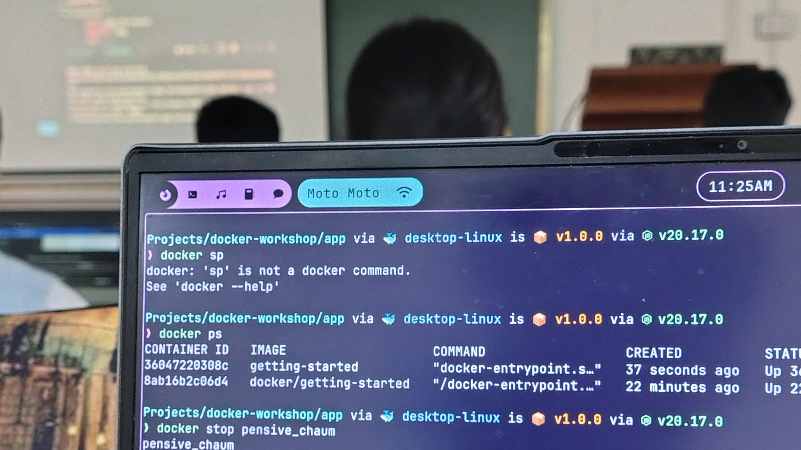
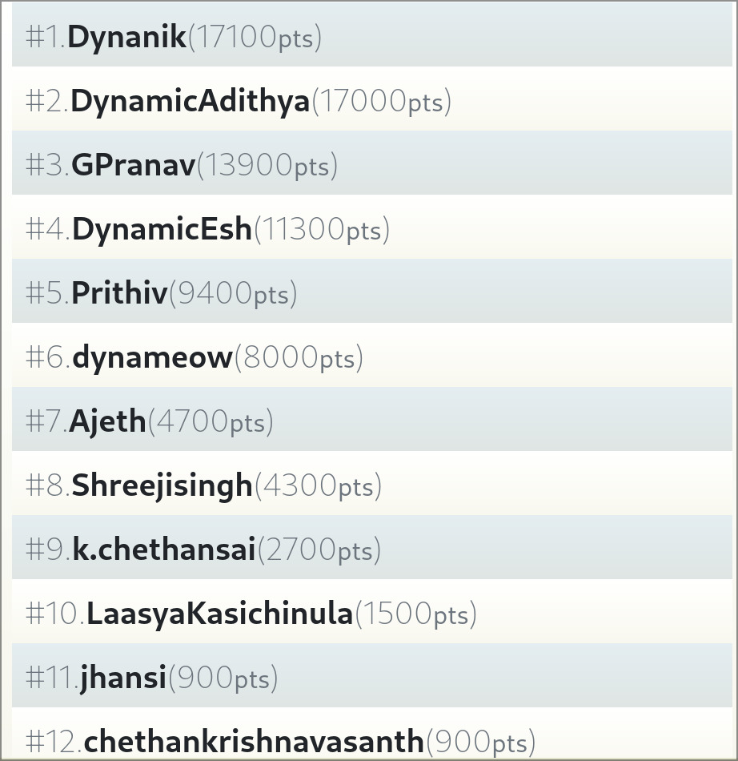
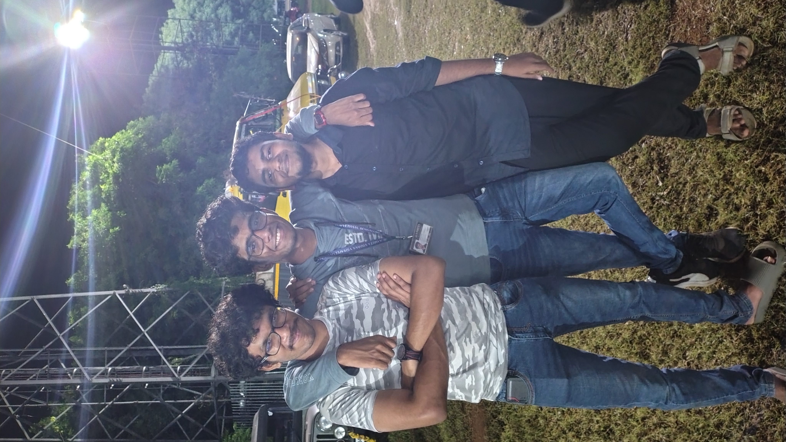

Anokha is the fest held by Amrita's Coimbatore campus. I bit the bullet and travelled with some friends all the way to Coimbatore. Note that this is my first proper trip on my own, without parental guidance.

# Day 1

We went by bus and reached around 9. There were three problems with this.

1. The campus could fit 15 of our own humble campus over at Bangalore.
2. There was a workshop we registered for at 9 on one corner of the campus
3. Our hostel was on the other end of the campus.

## The Kubernetes Workshop

So it was, what it was. Dumped our bags, shovelled water onto our faces and sprinted our way to the workshop.

The workshop in question was a Kubernetes workshop. It was, quite honestly, the only workshop that seemed interesting or of value. I've been wanting to learn kubernetes for a while now, and this was as great a time as any.

This workshop was the most expensive workshop on offer within Anokha, but it was quite possibly the best workshop I had the pleasure to be a part of. The instructor was a real Google developer who used this tool in his daily workflow. He was also an extremely capable and fun teacher. I'm taking notes on how to make [Missing Semester](https://github.com/nairadithya/missing-semester) more viable.

So, my [birdwatching high](https://adithyanair.com/journal/2024-10-11/birdwatching) has not worn off, I got very distracted midway through the workshop because of a very loud peacock right outside our classroom building. I didn't want to be rude to the presenter by going to the window and looking out, but I kept side-eyeing the window hoping it would show up.

Shout out to Unnikrishnan, Akhil and the rest of the people we met from the Amritapuri campus. Unbelievably nice people.

## The Campus

The college truly felt like one, like the large universities you hear about in movies and books. It's about a kilometer of a walk from our hostel to the canteen. Yet another to the library. It took us about 20 minutes to rush to our workshop.

Then there are the mountains.

There are mountains everywhere you look, and they look spectacular.

## The Canteen

A solid point towards Bangalore campus is that the canteen in Bangalore is far better. The food in the canteen felt old, and lacked the general standard that Bangalore campus seemed to maintain.

Me and Nikhil played this game of ordering items served in both campuses to compare both of them. Every item was either more expensive for the same quantity or less quantity. The value for money was lesser and the quality of each item was lesser. For context, we ordered kachori, tea and cream bun to compare.

Bangalore won in every regard except the non-veg, which is non-existent here.

# Day 2

## Wiki-Racing

The other event we participated in was on Day 2. We participated in a wiki-race event. For those who are unfamiliar, a wiki-race involves being dropped in a random Wikipedia page and clicking the internal links to get to a specific Wikipedia page in as short a 'link distance' and as fast as possible. I was introduced to this game a few days ago by Nikhil, and turns out I had a huge knack for getting there, might be part of the way I normally think about things, or might just be the random Wikipedia spirals I go down when I'm hyper-focused, who's to say?

We entered the venue and really started doubting ourselves. There was this guy practicing furiously before the competition. He had a big setup, his laptop was propped up, he had a mouse-pad and a mouse out, and he was tuning his _sensitivity_ to click the links as fast as possible. We thought we were done for.

Anyways after several technical delays and us getting stressed out over the competition, here are the results.

If it wasn't clear I was DynamicAdithya, and Nikhil was Dynanik. Easwer was DynamicEsh and Shravan was Dynameow. There's a whole story behind the names.

The guy tuning the sensitivity earlier? That's GPranav. I want you to marvel at the point difference between me and Nikhil, and marvel even more at the point difference between me and GPranav.

I am unreasonably proud of myself.

We ended up winning a cash prize for our excellent plays. I won 3,000 and Nikhil won 4,000. They are of course yet to transfer it so I have my doubts, but this marks the first cash prize I ever won, by name if not in cash.

## The Concert

I came down with a fever around the evening, might be the weather, the fact that I slept with no bedsheets, or the ice cream I had about 2 hours before the onset. I remember stewing in my own body heat in the library for about an hour or so, craving hot drinks constantly.

I almost decided to not attend the concert, but then I couldn't miss Stephen's performance. He's a musician I admire for being solely known for his instrumental performances and somehow exceeding the popularity of several mainstream singers.

Stephen is kind of a legend where I'm from, when I found out he's performing at Anokha, it was more reason for me to want to go. What I didn't expect was the equally revered violinist from Orfeo to also show up. This guy popped up on YouTube around 2015, and accelerated into fame quickly from there.

The concert was an absolute treat.

I was devastatingly sick but it was worth it. After the concert, we met up with a friend we were hunting for from the beginning of the concert (Amrita network coverage sucks), and we sprinted towards the night canteen all the way in the other side of campus to get some hot tea for my fever.

They ran out.

There was no tea that night.

Fun day tho.

# Day 3

Day 3 didn't have any major events, we chilled in the hostel with the ECE people who came in with us from Bangalore campus until noon.

I spent the majority of the morning trying and failing to set up Python on Windows for a friend. It was a nightmare that I do not wish on my worst enemy. When it comes to Python, everything's fine until something goes wrong. Because when something goes wrong, it usually goes HORRIBLY wrong.

For lunch, me and Easwer met up with our friend in Coimbatore. I was too sick to have any food, so we searched for tea or any equivalent hot beverage. We ended up going to the overpriced fest food stalls to buy hot chocolate, each cup cost 100 rupees but they served the job of warming my throat.

Slept through most of the remainder of the day, packed up and left around 7:30.

All in all, it was a fun trip. Would highly recommend going. Would not recommend getting sick tho.
